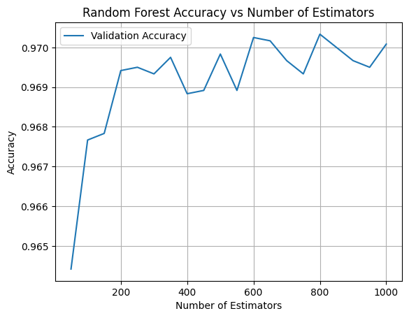
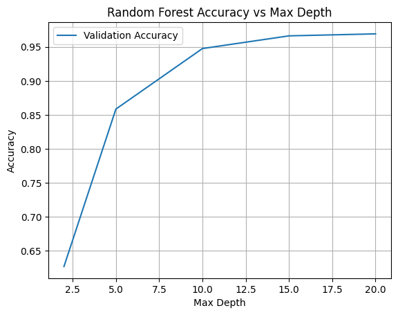
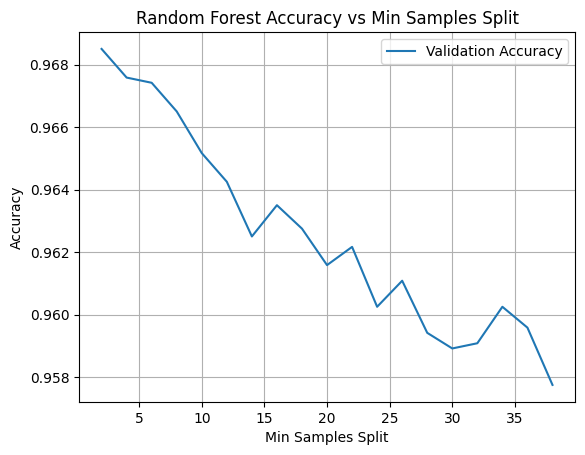
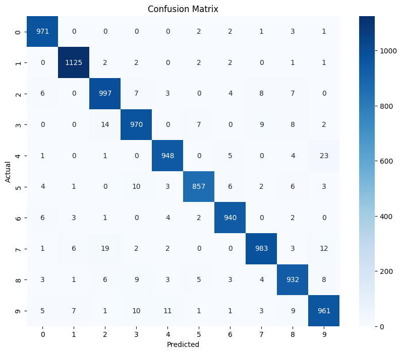
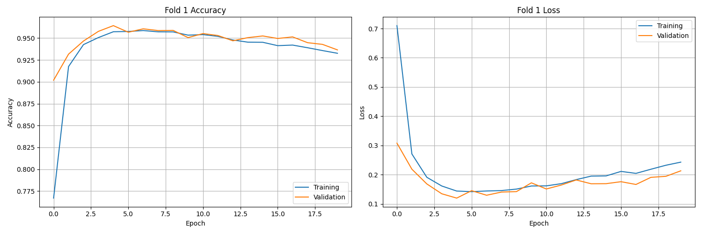
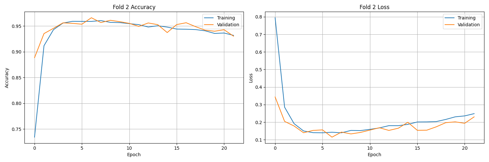
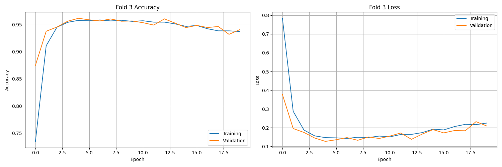
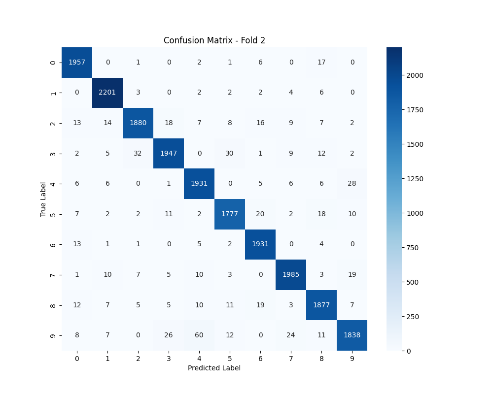
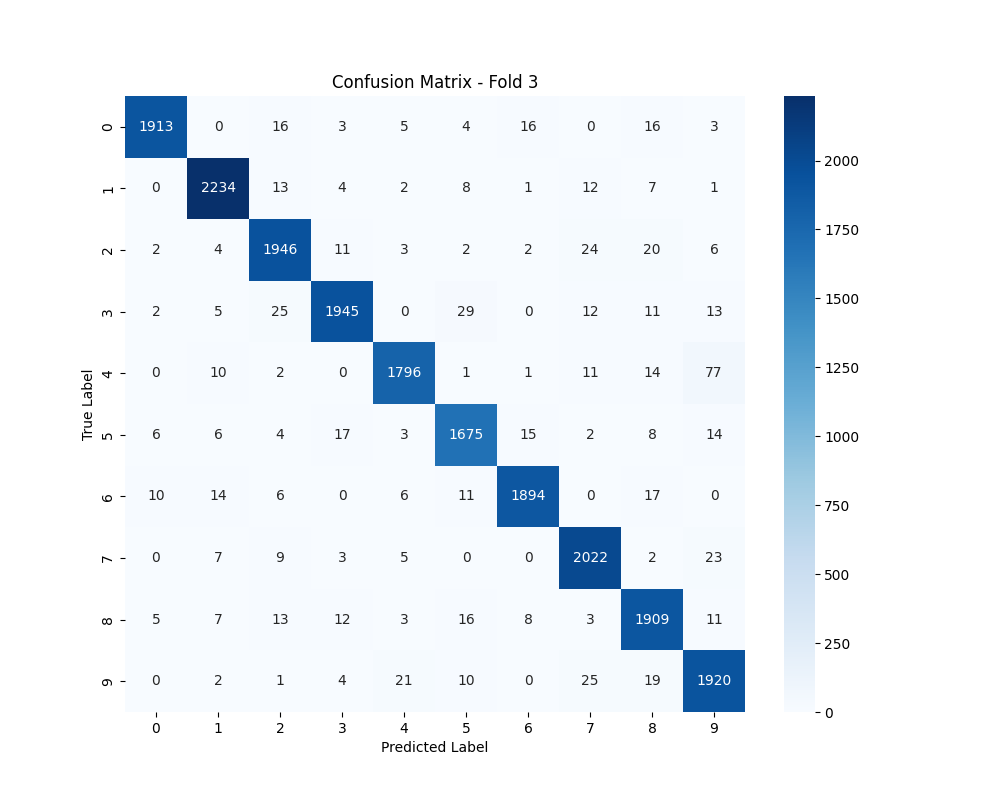

# Evaluating model's performance for SVM, RF and LSTM using MNIST dataset

## Random Forest

```json
{
  "n_estimators": range(50, 1050, 50),
  "max_depth": {2, 5, 10, 15, 20, None},
  "min_samples_split": range(2, 42, 2)
}
```

|  |  |
| ------------------------ | ----------------------- |
|  |                         |

Seeing that the best number of `estimators` is 650, best number of `max_depth` is 20 and best number of `min_samples_split` is 2. In combination, the resulting test accuracies yields

```python
Validation accuracy: 0.971
Validation Precision: 0.9710116403292254
Validation Recall: 0.971
Validation F1 Score: 0.9709933654164185
Cross Validation Scores: [0.96866667 0.96708333 0.96533333 0.96525    0.97183333]
Mean Cross Validation Score: 0.9676333333333333
```

As the number of estimators of `650` is quite high, and may result in higher computational cost with diminishing returns, I choose `150` to be the best combination of accuracy and efficiency. Indeed, the test yields

```python
Validation accuracy: 0.9696
Validation Precision: 0.9695990508409351
Validation Recall: 0.9696
Validation F1 Score: 0.9695861419399533
Cross Validation Scores: [0.96675    0.96475    0.9635     0.96316667 0.971     ]
Mean Cross Validation Score: 0.9658333333333333
```

which only differs a mere `.002` percentage point (this could be amount to the noise in the progress of training, but after 10 experiments, the results seems consistent)



## SVM

```json
{
  "n_epochs": 100
}
```

|  |  |
| --------------------------------- | ----------------------------- |
|  |  |
|  |  |

```bash
Fold 1 Results:
  Accuracy: 0.9107
  Precision: 0.9113
  Recall: 0.9107
  F1 Score: 0.9108

Fold 2 Results:
  Accuracy: 0.9077
  Precision: 0.9079
  Recall: 0.9077
  F1 Score: 0.9074

Fold 3 Results:
  Accuracy: 0.9094
  Precision: 0.9096
  Recall: 0.9094
  F1 Score: 0.9092

Average Results across all folds:
  Accuracy: 0.9093
  Precision: 0.9096
  Recall: 0.9093
  F1 Score: 0.9092
```

|  |  |
| ----------------------------------------- | ----------------------------------------- |
|  |                                           |

## LSTM

```json
{
  "n_epochs": 100
}
```

Below is the result of training v validation accuracy through each of the 100 epochs of LSTM





|  |  |
| ---------------------------------------------- | ---------------------------------------------- |
|  |                                                |

```bash
Early stopping triggered after epoch 20

Fold 1 Final Results:
  Accuracy: 0.9647
  Precision: 0.9649
  Recall: 0.9647
  F1 Score: 0.9647

Early stopping triggered after epoch 22

Fold 2 Final Results:
  Accuracy: 0.9662
  Precision: 0.9662
  Recall: 0.9662
  F1 Score: 0.9661

Early stopping triggered after epoch 20

Fold 3 Final Results:
  Accuracy: 0.9627
  Precision: 0.9630
  Recall: 0.9627
  F1 Score: 0.9627

Average Results across all folds:
  Accuracy: 0.9645
  Precision: 0.9647
  Recall: 0.9645
  F1: 0.9645
```
