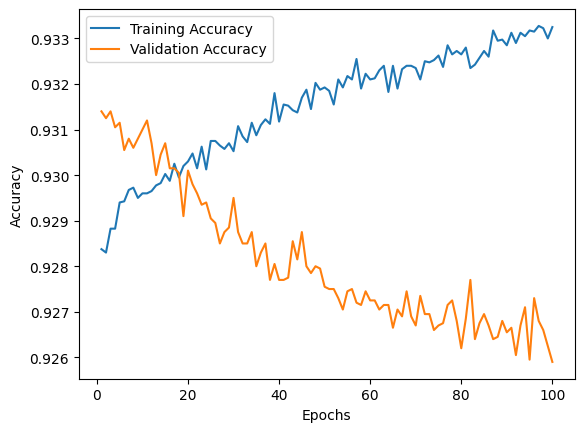

# Evaluating model's performance for SVM, RF and LSTM using MNIST dataset

## Random Forest

```json
{
  "n_estimators": [50...2000]
}
```


## SVM

```json
{
  "n_epochs": 100
}
```

|  |  |
| ----------------------------- | ----------------------------- |
|  |                               |

```text
Fold accuracy: 0.9259
SVM cross-validation scores: [0.92445, 0.9238, 0.9259]
Average accuracy: 0.9247166514396667
```

## LSTM

```json
{
  "n_epochs": 100
}
```

Below is the result of training v validation accuracy through each of the 100 epochs of LSTM

|  |  |
| ------------------------------ | ------------------------------ |
|  |                                |

```text
Fold accuracy: 0.9984
LSTM cross-validation scores: [0.985, 0.99745, 0.9984]
Average accuracy: 0.9936166405677795
```
